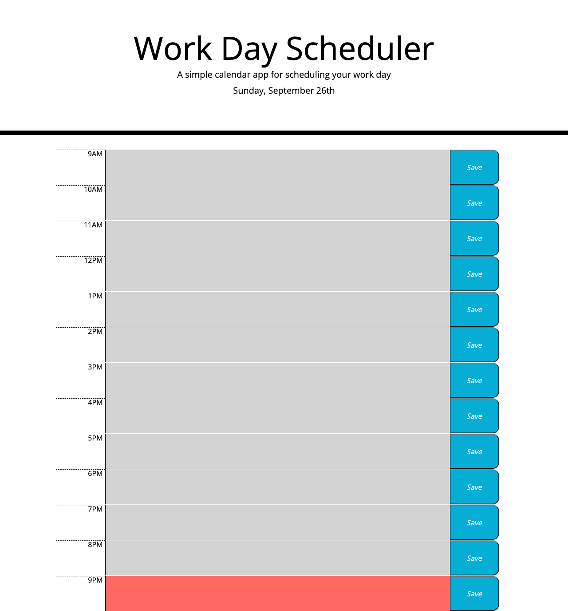

# The Planner App

## Better than a calendar. Maybe.

This day planner app was created using Moment.js and jQuery. It spans 12 hours (9AM to 9PM) and shows which hour-long timeslots are in the past, present, or future by way of color-coding. It also allows the user to input notes into each timeslot and save that note. The notes will persist when the user leaves and returns to the app. 

---

## Screenshot:

---

## Links:

### [GitHub Repository](https://github.com/Chrisaeus/Planner-App)

### [Live Website](https://chrisaeus.github.io/Planner-App/)